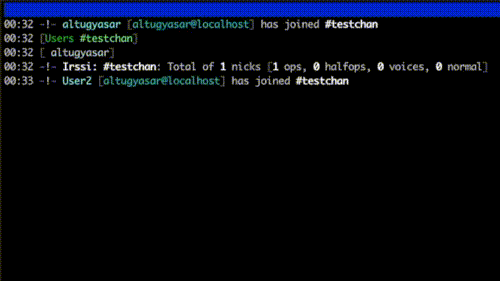

# 42-ft_irc

**Score: 100/100**

This project is about making a minimal IRC server using C++98.

## Usage

### To start irc server

Do `make` to get the executable `ircserv` program.

After getting the executable run it like `./ircserv [PORT NUMBER] [PASSWORD]`

### To start irc client

You can connect to server with `nc` or any IRC client that you want (preferably `irssi`).

With nc you need to:
```
nc -c localhost [PORT NUMBER]
PASS [password]
NICK [nickname]
USER [username] 0 * [realname]
```

With irssi you need to:
```
/connect localhost [PORT NUMBER] [PASSWORD]
```

After connecting the server you can join a channel and send messages in that channel.



## Commands You Can Use

- PASS [password]
- NICK [nickname]
- USER [username] 0 * [realname]
- JOIN #[channelname]
- PRIVMSG #[channelname] [message]
- PRIVMSG [nickname] [message]
- NOTICE #[channelname] [message]
- NOTICE [nickname] [message]
- PART #[channelname]
- KICK #[channelname] [nickname] (operator only)
